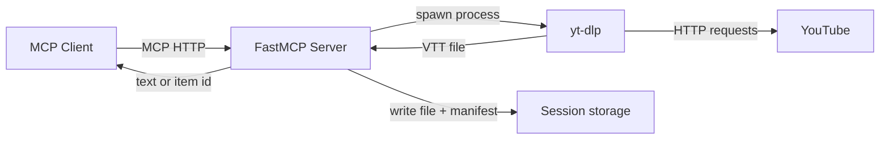
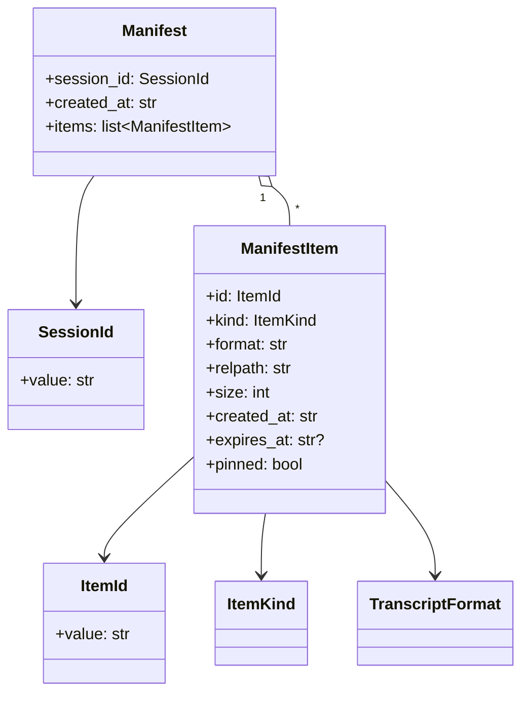
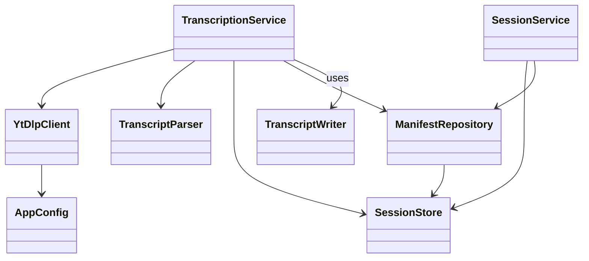
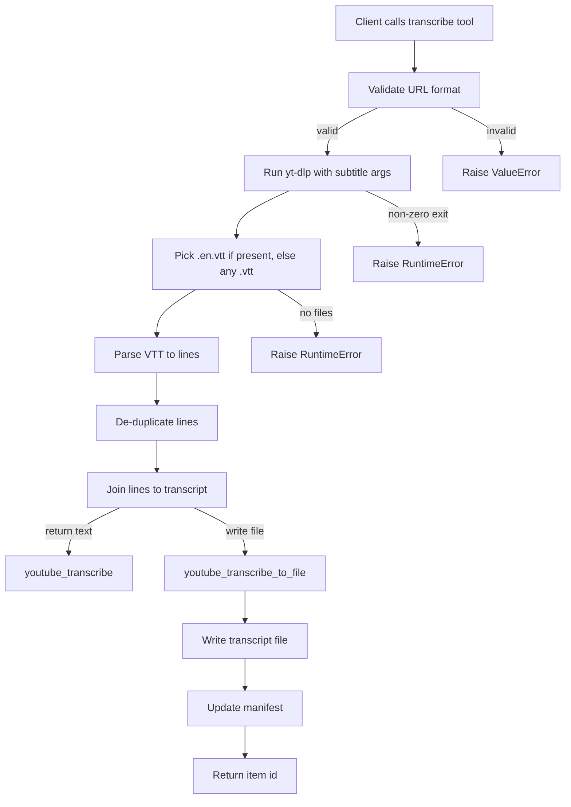
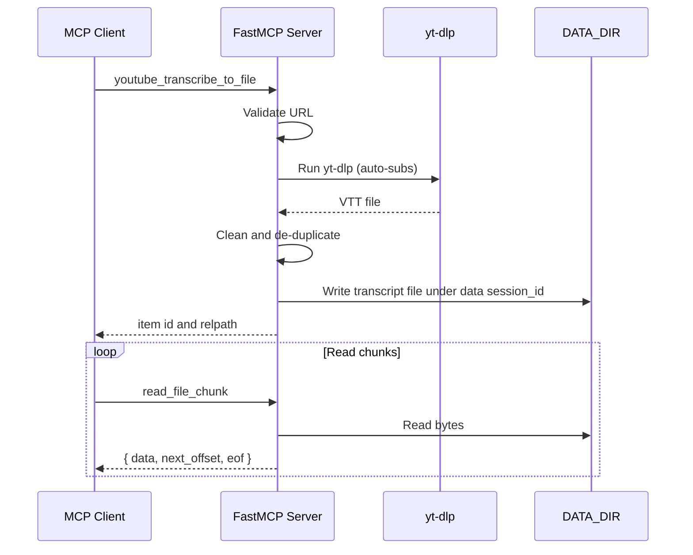

# Custom YouTube Transcribe MCP Server

A lightweight FastMCP server that uses `yt-dlp` to fetch YouTube subtitles, cleans them into plain text, and exposes tools for direct transcript retrieval or paged file reads. It is designed for MCP clients that need to reliably pull large transcripts without hitting response size limits.

## What it does

- Validates YouTube URLs (`youtube.com/watch?v=...` or `youtu.be/...`).
- Uses `yt-dlp` to download auto-generated subtitles in VTT format (English by default).
- Cleans and de-duplicates subtitle lines into a readable transcript.
- Exposes session-scoped tools for transcription, metadata, retention, and paging:
  - `youtube_transcribe`, `youtube_transcribe_to_file`, `youtube_transcribe_auto`
  - `youtube_get_duration`
  - `list_session_items`, `pin_item`, `unpin_item`, `set_item_ttl`, `delete_item`
  - `read_file_info`, `read_file_chunk`
  - `write_text_file` for storing derived outputs

## High-level architecture



## Class diagrams

### Domain model



### Services and adapters



## Detailed data flow



## Session storage layout

```
/data/
  <session_id>/
    manifest.json
    transcripts/
      youtube_<hash>_<timestamp>.txt
      youtube_<hash>_<timestamp>.vtt
      youtube_<hash>_<timestamp>.jsonl
    derived/
```

Each manifest item tracks:

```
{ id, kind, format, relpath, size, created_at, expires_at, pinned }
```

## VTT cleaning and de-duplication logic

The server normalizes WebVTT into a clean transcript by:

1. Dropping headers and metadata lines such as `WEBVTT`, `NOTE`, `STYLE`, `REGION`, `Kind:`, `Language:`.
2. Dropping cue timing lines like `00:00:01.000 --> 00:00:03.000`.
3. Removing inline timestamps like `<00:00:00.400>`.
4. Removing `<c>` tags and other HTML-like tags.
5. Normalizing whitespace.
6. De-duplicating lines with two rules:
   - Remove consecutive duplicates.
   - Remove recent duplicates within a rolling window (default window size 6) to reduce YouTube caption rollover and double tracks.

## MCP tools

Session-scoped tools accept `session_id` explicitly or infer it from the MCP HTTP header `mcp-session-id`.

### `youtube_transcribe(url: str) -> str`

- Returns plain transcript text.
- Intended for small to medium transcripts that fit in a single response.
- Raises errors on invalid URLs, failed `yt-dlp`, missing subtitles, or empty output after parsing.

### `youtube_transcribe_to_file(url: str, fmt: str = "txt", session_id: str | None = None) -> dict`

- Saves transcript under `/data/<session_id>/transcripts` and returns a manifest item object.
- `fmt` options:
  - `txt` (default): cleaned transcript text
  - `vtt`: raw VTT output from `yt-dlp`
  - `jsonl`: one JSON object per line: `{ "text": "..." }`
- Item fields: `{ id, kind, format, relpath, size, created_at, expires_at, pinned }`.

### `youtube_get_duration(url: str) -> dict`

- Returns `{ duration, duration_string, title, is_live }`.
- Useful for choosing a strategy before downloading subtitles.
- `duration` can be `null` for live streams.

### `youtube_transcribe_auto(url: str, fmt: str = "txt", max_text_bytes: int | None = None, session_id: str | None = None) -> dict`

- Returns text when the transcript size in UTF-8 bytes is below the threshold.
- Otherwise writes a file under `/data/<session_id>/transcripts` and returns a manifest item object.
- Includes `{ duration, duration_string, title, is_live }` from metadata.
- `max_text_bytes` defaults to `AUTO_TEXT_MAX_BYTES` when not provided.

### `list_session_items(kind: str | None = None, format: str | None = None, pinned: bool | None = None, session_id: str | None = None) -> dict`

- Returns manifest items for the session, optionally filtered by `kind`, `format`, or `pinned`.

### `pin_item(item_id: str, session_id: str | None = None) -> dict`

- Marks an item as pinned (no TTL cleanup).

### `unpin_item(item_id: str, session_id: str | None = None) -> dict`

- Removes pin and applies default TTL.

### `set_item_ttl(item_id: str, ttl_seconds: int, session_id: str | None = None) -> dict`

- Sets a custom TTL for an item (unpinned).

### `delete_item(item_id: str, session_id: str | None = None) -> dict`

- Deletes the file and removes it from the manifest.

### `write_text_file(relpath: str, content: str, overwrite: bool = False, session_id: str | None = None) -> dict`

- Writes a derived file under `/data/<session_id>/derived` and registers it in the manifest.

### `read_file_info(item_id: str | None = None, relpath: str | None = None, session_id: str | None = None) -> dict`

- Provide either `item_id` (preferred) or `relpath` (relative to session root).
- Returns `{ id, path, relpath, size, pinned, expires_at?, format, kind }`.

### `read_file_chunk(item_id: str | None = None, relpath: str | None = None, offset: int = 0, max_bytes: int = 200000, session_id: str | None = None) -> dict`

- Provide either `item_id` (preferred) or `relpath`.
- Returns `data` (decoded text), `next_offset`, `eof`, `size`, `path`, `id`.
- `max_bytes` is clamped to `1..200000`.

## MCP request/response examples

These examples show raw JSON-RPC payloads over HTTP (`POST /mcp`). Client SDKs often hide this, but the structure is the same.

### `youtube_transcribe`

Request:

```json
{
  "jsonrpc": "2.0",
  "id": 1,
  "method": "tools/call",
  "params": {
    "name": "youtube_transcribe",
    "arguments": {
      "url": "https://www.youtube.com/watch?v=dQw4w9WgXcQ"
    }
  }
}
```

Response:

```json
{
  "jsonrpc": "2.0",
  "id": 1,
  "result": {
    "content": [
      {
        "type": "text",
        "text": "Line 1\nLine 2\nLine 3"
      }
    ]
  }
}
```

### `youtube_transcribe_to_file`

Request:

```json
{
  "jsonrpc": "2.0",
  "id": 2,
  "method": "tools/call",
  "params": {
    "name": "youtube_transcribe_to_file",
    "arguments": {
      "url": "https://youtu.be/dQw4w9WgXcQ",
      "session_id": "sess_123",
      "fmt": "jsonl"
    }
  }
}
```

Response:

```json
{
  "jsonrpc": "2.0",
  "id": 2,
  "result": {
    "content": [
      {
        "type": "json",
        "json": {
          "id": "tr_58aafd83e6f14c6e8c2f1c5f21d9a2a1",
          "session_id": "sess_123",
          "relpath": "transcripts/youtube_a1b2c3d4e5_20240101T120000Z.jsonl",
          "expires_at": "2025-01-01T12:00:00Z",
          "pinned": false,
          "format": "jsonl",
          "size": 123456,
          "kind": "transcript",
          "created_at": "2025-01-01T11:00:00Z"
        }
      }
    ]
  }
}
```

### `youtube_get_duration`

Request:

```json
{
  "jsonrpc": "2.0",
  "id": 3,
  "method": "tools/call",
  "params": {
    "name": "youtube_get_duration",
    "arguments": {
      "url": "https://youtu.be/dQw4w9WgXcQ"
    }
  }
}
```

Response:

```json
{
  "jsonrpc": "2.0",
  "id": 3,
  "result": {
    "content": [
      {
        "type": "json",
        "json": {
          "duration": 213,
          "duration_string": "00:03:33",
          "title": "Example Title",
          "is_live": false
        }
      }
    ]
  }
}
```

Note: metadata responses may be served from the in-memory cache for up to
`YTDLP_INFO_CACHE_TTL_SEC` seconds to reduce repeated yt-dlp calls.

### `youtube_transcribe_auto`

Request:

```json
{
  "jsonrpc": "2.0",
  "id": 4,
  "method": "tools/call",
  "params": {
    "name": "youtube_transcribe_auto",
    "arguments": {
      "url": "https://youtu.be/dQw4w9WgXcQ",
      "fmt": "txt",
      "max_text_bytes": 150000,
      "session_id": "sess_123"
    }
  }
}
```

Response (text):

```json
{
  "jsonrpc": "2.0",
  "id": 4,
  "result": {
    "content": [
      {
        "type": "json",
        "json": {
          "kind": "text",
          "text": "Line 1\nLine 2\nLine 3",
          "bytes": 12345,
          "duration": 213,
          "duration_string": "00:03:33",
          "title": "Example Title",
          "is_live": false
        }
      }
    ]
  }
}
```

Response (file):

```json
{
  "jsonrpc": "2.0",
  "id": 4,
  "result": {
    "content": [
      {
        "type": "json",
        "json": {
          "kind": "file",
          "id": "tr_58aafd83e6f14c6e8c2f1c5f21d9a2a1",
          "session_id": "sess_123",
          "relpath": "transcripts/youtube_a1b2c3d4e5_20240101T120000Z.txt",
          "expires_at": "2025-01-01T12:00:00Z",
          "pinned": false,
          "format": "txt",
          "size": 987654,
          "created_at": "2025-01-01T11:00:00Z",
          "bytes": 987654,
          "duration": 213,
          "duration_string": "00:03:33",
          "title": "Example Title",
          "is_live": false
        }
      }
    ]
  }
}
```

### `read_file_info`

Request:

```json
{
  "jsonrpc": "2.0",
  "id": 5,
  "method": "tools/call",
  "params": {
    "name": "read_file_info",
    "arguments": {
      "item_id": "tr_58aafd83e6f14c6e8c2f1c5f21d9a2a1",
      "session_id": "sess_123"
    }
  }
}
```

Response:

```json
{
  "jsonrpc": "2.0",
  "id": 5,
  "result": {
    "content": [
      {
        "type": "json",
        "json": {
          "id": "tr_58aafd83e6f14c6e8c2f1c5f21d9a2a1",
          "session_id": "sess_123",
          "path": "/data/sess_123/transcripts/youtube_a1b2c3d4e5_20240101T120000Z.txt",
          "relpath": "transcripts/youtube_a1b2c3d4e5_20240101T120000Z.txt",
          "size": 120345,
          "expires_at": "2025-01-01T12:00:00Z",
          "pinned": false,
          "format": "txt",
          "kind": "transcript"
        }
      }
    ]
  }
}
```

### `read_file_chunk`

Request:

```json
{
  "jsonrpc": "2.0",
  "id": 6,
  "method": "tools/call",
  "params": {
    "name": "read_file_chunk",
    "arguments": {
      "item_id": "tr_58aafd83e6f14c6e8c2f1c5f21d9a2a1",
      "session_id": "sess_123",
      "offset": 0,
      "max_bytes": 200000
    }
  }
}
```

Response:

```json
{
  "jsonrpc": "2.0",
  "id": 6,
  "result": {
    "content": [
      {
        "type": "json",
        "json": {
          "data": "First chunk of text...",
          "next_offset": 200000,
          "eof": false,
          "size": 120345,
          "path": "/data/sess_123/transcripts/youtube_a1b2c3d4e5_20240101T120000Z.txt",
          "id": "tr_58aafd83e6f14c6e8c2f1c5f21d9a2a1"
        }
      }
    ]
  }
}
```

## Resources

Resources are session-scoped. Use your session id in the URI (it must match `mcp-session-id` if the header is present).

- `transcripts://session/{session_id}/index` returns the session manifest.
- `transcripts://session/{session_id}/latest` returns the most recent transcript item.
- `transcripts://session/{session_id}/item/{id}` returns item metadata and inline content if small.

Example response for `transcripts://session/sess_123/item/tr_58aafd83e6f14c6e8c2f1c5f21d9a2a1`:

```json
{
  "session_id": "sess_123",
  "item": {
    "id": "tr_58aafd83e6f14c6e8c2f1c5f21d9a2a1",
    "kind": "transcript",
    "format": "txt",
    "relpath": "transcripts/youtube_a1b2c3d4e5_20240101T120000Z.txt",
    "size": 120345,
    "created_at": "2025-01-01T11:00:00Z",
    "expires_at": "2025-01-01T12:00:00Z",
    "pinned": false
  },
  "content": "Line 1\nLine 2\nLine 3",
  "truncated": false,
  "inline_max_bytes": 20000
}
```

## Resource templates (prompt-only)

Templates emit prompts for the calling agent to run. They do not perform AI work on the server.

- `template://transcript/paragraphs/{id}`
- `template://transcript/summary/{id}`
- `template://transcript/translate/{id}/{target_lang}`
- `template://transcript/outline/{id}`
- `template://transcript/quotes/{id}`
- `template://transcript/faq/{id}`
- `template://transcript/glossary/{id}`
- `template://transcript/action-items/{id}`

Example response for `template://transcript/summary/tr_58aafd83e6f14c6e8c2f1c5f21d9a2a1`:

```json
{
  "name": "summary",
  "inputs": {
    "item_id": "tr_58aafd83e6f14c6e8c2f1c5f21d9a2a1",
    "session_id": "sess_123"
  },
  "prompt": "Summarize the transcript with: 1) A one-paragraph executive summary. 2) 5-8 bullet key points. Keep it concise and faithful to the source.",
  "recommended_steps": [
    "Call transcripts://session/sess_123/item/tr_58aafd83e6f14c6e8c2f1c5f21d9a2a1 to get metadata and inline content.",
    "If content is missing or truncated, call read_file_chunk(item_id=\"tr_58aafd83e6f14c6e8c2f1c5f21d9a2a1\", session_id=\"sess_123\", offset=0, max_bytes=200000) until eof.",
    "Complete the task and output only the result.",
    "If you need this transcript later, call pin_item(item_id=\"tr_58aafd83e6f14c6e8c2f1c5f21d9a2a1\")."
  ]
}
```

## File naming scheme

Files written by `youtube_transcribe_to_file` use:

```
youtube_{sha1(url)[:10]}_{utc_timestamp}.{ext}
```

Example: `/data/sess_123/transcripts/youtube_a1b2c3d4e5_20240101T120000Z.txt`

Each session maintains a manifest:

```
/data/<session_id>/manifest.json
```

## Retention and expiry

- By default, file outputs expire after `TRANSCRIPT_TTL_SECONDS` (1 hour).
- Expired, unpinned files are cleaned up when the session is accessed (transcribe or read).
- Pinning an item (`pin_item`) clears `expires_at` and prevents TTL cleanup.
- Limits can be enforced via `MAX_SESSION_ITEMS` and `MAX_SESSION_BYTES`.

## Configuration

Environment variables:

- `PORT` (default `8080`): HTTP port.
- `DATA_DIR` (default `/data`): output directory for transcripts.
- `YTDLP_BIN` (default `yt-dlp`): path to the yt-dlp binary.
- `YTDLP_PLAYER_CLIENT` (default `web_safari`): YouTube player client used by yt-dlp.
- `YTDLP_REMOTE_EJS` (default `ejs:github`): yt-dlp remote components selector.
- `YTDLP_SUB_LANG` (default `en.*`): subtitle language pattern.
- `YTDLP_TIMEOUT_SEC` (default `180`): yt-dlp subprocess timeout.
- `YTDLP_INFO_CACHE_TTL_SEC` (default `300`): cache TTL for yt-dlp metadata lookups.
- `AUTO_TEXT_MAX_BYTES` (default `200000`): threshold for `youtube_transcribe_auto` text responses.
- `TRANSCRIPT_TTL_SECONDS` (default `3600`): file expiry for session items (falls back to `DEFAULT_TTL_SEC` if set).
- `INLINE_TEXT_MAX_BYTES` (default `20000`): inline content threshold for `transcripts://session/{session_id}/item/{id}`.
- `MAX_SESSION_ITEMS` (default `0` unlimited): max items per session.
- `MAX_SESSION_BYTES` (default `0` unlimited): max bytes per session.
- `DEFAULT_SESSION_ID` (default empty): fallback session id when no `session_id` or `mcp-session-id` is provided.

## Session identification

The server scopes data by session. Tools and resources use the MCP HTTP header `mcp-session-id` when available. If your client cannot send it, pass `session_id` explicitly to tools that require it. When both are present, they must match. If neither is provided, the server can fall back to `DEFAULT_SESSION_ID`.

## Agent configuration examples

These snippets show how to register the running HTTP MCP server at `http://localhost:8080/mcp`. File paths and keys vary by client, so treat them as templates.

### Codex CLI (`~/.codex/config.toml` template)

```toml
[features]
# Required in some Codex versions for HTTP MCP servers.
experimental_use_rmcp_client = true

[mcp_servers.yt_dlp_transcriber]
transport = "http"
url = "http://localhost:8080/mcp"
```

### Claude Desktop (`claude_desktop_config.json` template)

```json
{
  "mcpServers": {
    "yt-dlp-transcriber": {
      "transport": "http",
      "url": "http://localhost:8080/mcp"
    }
  }
}
```

If your Claude build only supports stdio-based MCP servers, run a local MCP bridge or adapt the server to stdio (not included here).

### Other dev agents (Cursor, Cline, Continue, etc.)

```json
{
  "mcpServers": {
    "yt-dlp-transcriber": {
      "transport": "http",
      "url": "http://localhost:8080/mcp"
    }
  }
}
```

## Running locally (no Docker)

Prerequisites:

- Python 3.12+
- `yt-dlp` available on PATH

```bash
python -m venv .venv
. .venv/bin/activate
pip install -r requirements.txt
export PORT=8080
export DATA_DIR=/tmp/yt-transcripts
mkdir -p "$DATA_DIR"
PYTHONPATH=src python -m yt_dlp_transcriber.server
```

The MCP HTTP endpoint listens at:

```
http://localhost:8080/mcp
```

Use an MCP-capable client to invoke the tools.

## Makefile shortcuts

If you prefer a repeatable local workflow, use the included `Makefile`:

```bash
make install
make run
make test
```

Optional overrides:

```bash
make run PORT=9090 DATA_DIR=./data
make docker-build IMAGE=yt-dlp-transcriber:local
make docker-run PORT=8080 DATA_DIR=./data IMAGE=yt-dlp-transcriber:local
```

## Testing

Install dev dependencies and run tests (pytest.ini sets PYTHONPATH=src):

```bash
pip install -r requirements-dev.txt
pytest
```

Coverage (line-level):

```bash
python -m coverage run -m pytest
python -m coverage report -m
```

## Docker usage

### Build

```bash
docker build -t yt-dlp-transcriber:local .
```

### Run

Bind-mount a host directory to persist transcripts and expose the MCP port:

```bash
docker run --rm -p 8080:8080 \
  -v "$PWD/data:/data" \
  -e PORT=8080 \
  yt-dlp-transcriber:local
```

This container installs `yt-dlp` and starts the FastMCP server at `http://localhost:8080/mcp`.

## Sequence diagram (paged read)



## Error handling and limits

- Invalid URL format: `ValueError` with a message describing expected URL formats.
- `yt-dlp` failure or timeout: `RuntimeError` with captured stdout.
- Missing subtitles: `RuntimeError` with `yt-dlp` output.
- `read_file_chunk` validates `max_bytes` and file existence.
- MCP errors include explicit codes in the error message: `ERR_INVALID_SESSION`, `ERR_INVALID_ITEM`,
  `ERR_NOT_FOUND`, `ERR_EXPIRED_ITEM`, `ERR_EXTERNAL_COMMAND`.

## Notes and behavior details

- The server is stateless over HTTP, and file outputs are scoped to `/data/<session_id>` with TTL-based expiry and a session manifest.
- Subtitle language defaults to English (`en.*`). Adjust with `YTDLP_SUB_LANG`.
- The server prefers `.en.vtt` outputs when multiple subtitle files exist.
- `youtube_transcribe_auto` chooses text vs file output based on UTF-8 byte size, returning `kind: "text"` or `kind: "file"`.
- `youtube_transcribe_auto` performs a metadata call (`youtube_get_duration`) before downloading subtitles.
- `session_id` must be 1-64 characters of letters, numbers, `-`, or `_`.
- Pinned items are exempt from TTL cleanup.
- `read_file_chunk` decodes bytes using UTF-8 with replacement for invalid sequences.

## Logging

The server emits structured logs via the `yt_dlp_transcriber` logger at debug,
info, warning, and error levels. Configure logging in the hosting process to
see the details:

```python
import logging

logging.basicConfig(level=logging.INFO)
logging.getLogger("yt_dlp_transcriber").setLevel(logging.DEBUG)
```

## Repository layout

- `src/yt_dlp_transcriber/server.py`: thin composition root that starts FastMCP.
- `src/yt_dlp_transcriber/mcp/`: FastMCP wiring (tools/resources/templates/deps).
- `src/yt_dlp_transcriber/services/`: application services for transcription and sessions.
- `src/yt_dlp_transcriber/adapters/`: filesystem + yt-dlp adapters.
- `src/yt_dlp_transcriber/ports/`: protocols for repositories and transcribers.
- `src/yt_dlp_transcriber/domain/`: domain models, enums, and value objects.
- `src/yt_dlp_transcriber/__init__.py`: package marker.
- `tests`: unit tests for domain, storage, services, and MCP resources/templates.
- `requirements.txt`: runtime dependencies.
- `requirements-dev.txt`: test dependencies.
- `Dockerfile`: container build for running the server.
- `Makefile`: local dev, test, and Docker shortcuts.
