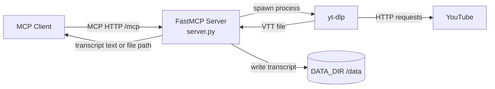
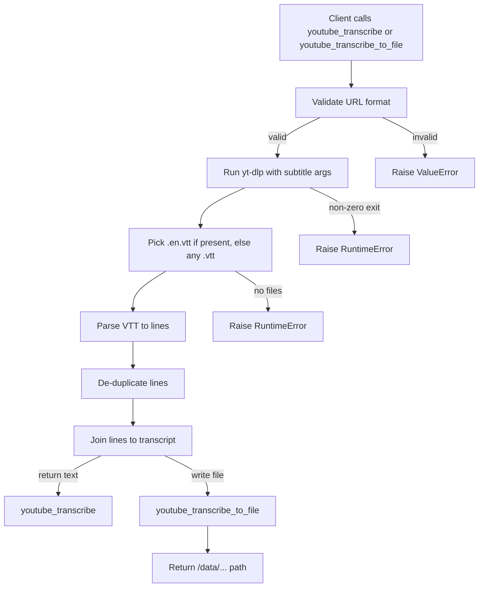
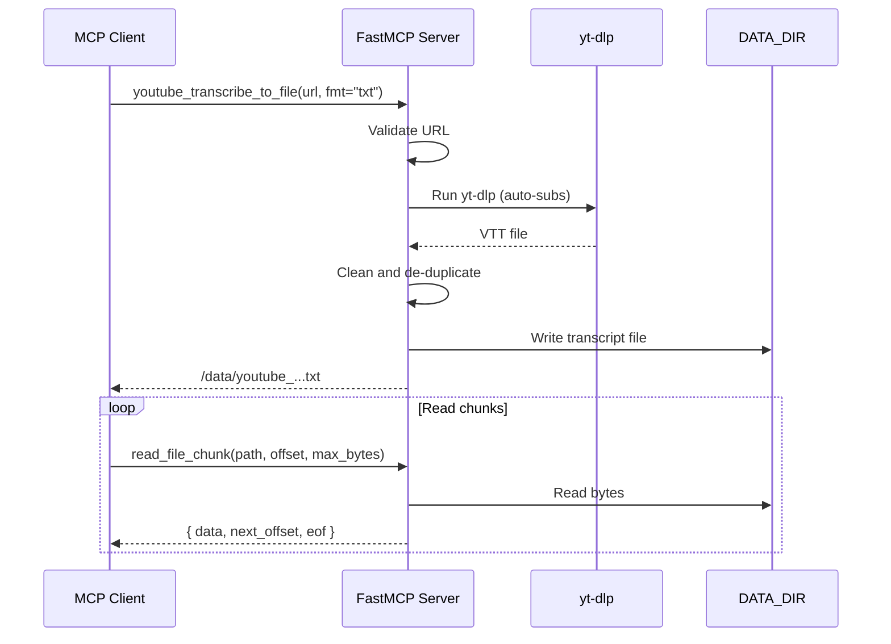

# Custom YouTube Transcribe MCP Server

A lightweight FastMCP server that uses `yt-dlp` to fetch YouTube subtitles, cleans them into plain text, and exposes tools for direct transcript retrieval or paged file reads. It is designed for MCP clients that need to reliably pull large transcripts without hitting response size limits.

## What it does

- Validates YouTube URLs (`youtube.com/watch?v=...` or `youtu.be/...`).
- Uses `yt-dlp` to download auto-generated subtitles in VTT format (English by default).
- Cleans and de-duplicates subtitle lines into a readable transcript.
- Exposes three MCP tools:
  - `youtube_transcribe` returns transcript text directly.
  - `youtube_transcribe_to_file` saves transcript to disk and returns the file path.
  - `read_file_chunk` pages large transcripts from disk.

## High-level architecture



## Detailed data flow



## VTT cleaning and de-duplication logic

The server normalizes WebVTT into a clean transcript by:

1. Dropping headers and metadata lines such as `WEBVTT`, `NOTE`, `STYLE`, `REGION`, `Kind:`, `Language:`.
2. Dropping cue timing lines like `00:00:01.000 --> 00:00:03.000`.
3. Removing inline timestamps like `<00:00:00.400>`.
4. Removing `<c>` tags and other HTML-like tags.
5. Normalizing whitespace.
6. De-duplicating lines with two rules:
   - Remove consecutive duplicates.
   - Remove recent duplicates within a rolling window (default window size 6) to reduce YouTube caption rollover and double tracks.

## MCP tools

### `youtube_transcribe(url: str) -> str`

- Returns plain transcript text.
- Intended for small to medium transcripts that fit in a single response.
- Raises errors on invalid URLs, failed `yt-dlp`, missing subtitles, or empty output after parsing.

### `youtube_transcribe_to_file(url: str, fmt: str = "txt") -> str`

- Saves transcript to disk under `DATA_DIR` and returns the file path.
- `fmt` options:
  - `txt` (default): cleaned transcript text
  - `vtt`: raw VTT output from `yt-dlp`
  - `jsonl`: one JSON object per line: `{ "text": "..." }`

### `read_file_chunk(path: str, offset: int = 0, max_bytes: int = 200000) -> dict`

- Reads a byte range from a saved file and returns:
  - `data` (decoded text), `next_offset`, `eof`, `size`, `path`
- Accepts absolute paths or relative paths (relative paths are resolved under `DATA_DIR`).
- `max_bytes` is clamped to `1..200000`.

## MCP request/response examples

These examples show raw JSON-RPC payloads over HTTP (`POST /mcp`). Client SDKs often hide this, but the structure is the same.

### `youtube_transcribe`

Request:

```json
{
  "jsonrpc": "2.0",
  "id": 1,
  "method": "tools/call",
  "params": {
    "name": "youtube_transcribe",
    "arguments": {
      "url": "https://www.youtube.com/watch?v=dQw4w9WgXcQ"
    }
  }
}
```

Response:

```json
{
  "jsonrpc": "2.0",
  "id": 1,
  "result": {
    "content": [
      {
        "type": "text",
        "text": "Line 1\nLine 2\nLine 3"
      }
    ]
  }
}
```

### `youtube_transcribe_to_file`

Request:

```json
{
  "jsonrpc": "2.0",
  "id": 2,
  "method": "tools/call",
  "params": {
    "name": "youtube_transcribe_to_file",
    "arguments": {
      "url": "https://youtu.be/dQw4w9WgXcQ",
      "fmt": "jsonl"
    }
  }
}
```

Response:

```json
{
  "jsonrpc": "2.0",
  "id": 2,
  "result": {
    "content": [
      {
        "type": "text",
        "text": "/data/youtube_a1b2c3d4e5_20240101T120000Z.jsonl"
      }
    ]
  }
}
```

### `read_file_chunk`

Request:

```json
{
  "jsonrpc": "2.0",
  "id": 3,
  "method": "tools/call",
  "params": {
    "name": "read_file_chunk",
    "arguments": {
      "path": "/data/youtube_a1b2c3d4e5_20240101T120000Z.txt",
      "offset": 0,
      "max_bytes": 200000
    }
  }
}
```

Response:

```json
{
  "jsonrpc": "2.0",
  "id": 3,
  "result": {
    "content": [
      {
        "type": "json",
        "json": {
          "data": "First chunk of text...",
          "next_offset": 200000,
          "eof": false,
          "size": 120345,
          "path": "/data/youtube_a1b2c3d4e5_20240101T120000Z.txt"
        }
      }
    ]
  }
}
```

## File naming scheme

Files written by `youtube_transcribe_to_file` use:

```
youtube_{sha1(url)[:10]}_{utc_timestamp}.{ext}
```

Example: `youtube_a1b2c3d4e5_20240101T120000Z.txt`

## Configuration

Environment variables:

- `PORT` (default `8080`): HTTP port.
- `DATA_DIR` (default `/data`): output directory for transcripts.
- `YTDLP_BIN` (default `yt-dlp`): path to the yt-dlp binary.
- `YTDLP_PLAYER_CLIENT` (default `web_safari`): YouTube player client used by yt-dlp.
- `YTDLP_REMOTE_EJS` (default `ejs:github`): yt-dlp remote components selector.
- `YTDLP_SUB_LANG` (default `en.*`): subtitle language pattern.
- `YTDLP_TIMEOUT_SEC` (default `180`): yt-dlp subprocess timeout.

## Agent configuration examples

These snippets show how to register the running HTTP MCP server at `http://localhost:8080/mcp`. File paths and keys vary by client, so treat them as templates.

### Codex CLI (`~/.codex/config.toml` template)

```toml
[features]
# Required in some Codex versions for HTTP MCP servers.
experimental_use_rmcp_client = true

[mcp_servers.yt_dlp_transcriber]
transport = "http"
url = "http://localhost:8080/mcp"
```

### Claude Desktop (`claude_desktop_config.json` template)

```json
{
  "mcpServers": {
    "yt-dlp-transcriber": {
      "transport": "http",
      "url": "http://localhost:8080/mcp"
    }
  }
}
```

If your Claude build only supports stdio-based MCP servers, run a local MCP bridge or adapt the server to stdio (not included here).

### Other dev agents (Cursor, Cline, Continue, etc.)

```json
{
  "mcpServers": {
    "yt-dlp-transcriber": {
      "transport": "http",
      "url": "http://localhost:8080/mcp"
    }
  }
}
```

## Running locally (no Docker)

Prerequisites:

- Python 3.12+
- `yt-dlp` available on PATH

```bash
python -m venv .venv
. .venv/bin/activate
pip install -r requirements.txt
export PORT=8080
export DATA_DIR=/tmp/yt-transcripts
mkdir -p "$DATA_DIR"
python server.py
```

The MCP HTTP endpoint listens at:

```
http://localhost:8080/mcp
```

Use an MCP-capable client to invoke the tools.

## Makefile shortcuts

If you prefer a repeatable local workflow, use the included `Makefile`:

```bash
make install
make run
```

Optional overrides:

```bash
make run PORT=9090 DATA_DIR=./data
make docker-build IMAGE=yt-dlp-transcriber:local
make docker-run PORT=8080 DATA_DIR=./data IMAGE=yt-dlp-transcriber:local
```

## Docker usage

### Build

```bash
docker build -t yt-dlp-transcriber:local .
```

### Run

Bind-mount a host directory to persist transcripts and expose the MCP port:

```bash
docker run --rm -p 8080:8080 \
  -v "$PWD/data:/data" \
  -e PORT=8080 \
  yt-dlp-transcriber:local
```

This container installs `yt-dlp` and starts the FastMCP server at `http://localhost:8080/mcp`.

## Sequence diagram (paged read)



## Error handling and limits

- Invalid URL format: `ValueError` with a message describing expected URL formats.
- `yt-dlp` failure or timeout: `RuntimeError` with captured stdout.
- Missing subtitles: `RuntimeError` with `yt-dlp` output.
- `read_file_chunk` validates `max_bytes` and file existence.

## Notes and behavior details

- The server is stateless over HTTP, but outputs are persisted to `DATA_DIR`.
- Subtitle language defaults to English (`en.*`). Adjust with `YTDLP_SUB_LANG`.
- The server prefers `.en.vtt` outputs when multiple subtitle files exist.
- `read_file_chunk` decodes bytes using UTF-8 with replacement for invalid sequences.

## Repository layout

- `server.py`: FastMCP server implementation and subtitle processing.
- `requirements.txt`: Python dependency list.
- `Dockerfile`: container build for running the server.
- `Makefile`: local dev and Docker shortcuts.
